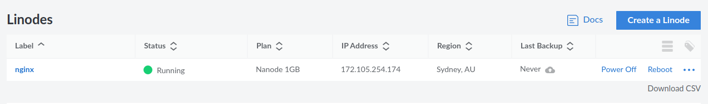
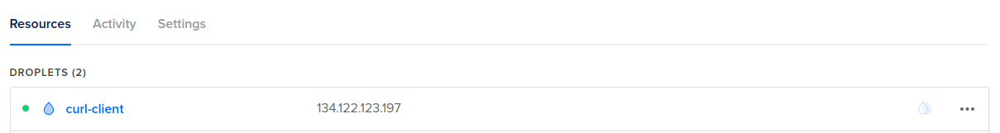

# Nginx + Curl + Ansible
This tutorial is going to demonstrate how to start a simple Syntropy network, consisting of a server running Nginx and a client using curl, with the help of Ansible.

## Requirements
* An active [Syntropy Stack](https://www.syntropystack.com/) account
* Two separate servers running on separate cloud providers
* Python >= 3.6 with pip3 installed
* Ansible >= 2.10 installed on your local machine

## Installation

For this example, you will need the Syntropy Stack ansible collection
and its dependencies. To install them run:

```
ansible-galaxy collection install git@github.com:SyntropyNet/syntropy-ansible-collection.git
```

To install the collection's dependencies, navigate into the collection directory.

If you using Linux, you can execute that command:
```
cd /home/{current-user}/.ansible/collections/ansible_collections/syntropynet/syntropy
```

Then run:
```
pip3 install -U -r requirements.txt
```

## Variables

In order Ansible to be able to set up everything automatically,
you will need to input a few variables in 
`ansible/vars/main.yml`. The example is
`main.yml.example` file.

You will need a [Syntropy Agent Token](https://docs.syntropystack.com/docs/get-your-agent-token).


## Deploying NGINX and agents using Ansible

Create a Ansible inventory file named `inventory.yml` following the template  `ansible_inventory.tmpl`.

In order to finish the deployment, you need to run the Ansible playbook:

```
ansible-playbook main.yml -i inventory.yml
```

## Verify that your machines are up and running

The status of the machines should look something like this (Linode and DigitalOcean
respectively):




## SSH into the Curl client machine

You can find the Curl virtual machine IP address in the `ansible/inventory.yml`
file. Log into it using the command `ssh root@<CURL_MACHINE_IP> -i <private_key_file>`.
After that, you can run the command `curl http://<NGINX_DOCKER_IP>` 
and you should receive a response:
```html
<!DOCTYPE html>
<html>
<head>
<title>Welcome to nginx!</title>
<style>
    body {
        width: 35em;
        margin: 0 auto;
        font-family: Tahoma, Verdana, Arial, sans-serif;
    }
</style>
</head>
<body>
<h1>Welcome to nginx!</h1>
<p>If you see this page, the nginx web server is successfully installed and
working. Further configuration is required.</p>

<p>For online documentation and support please refer to
<a href="http://nginx.org/">nginx.org</a>.<br/>
Commercial support is available at
<a href="http://nginx.com/">nginx.com</a>.</p>

<p><em>Thank you for using nginx.</em></p>
</body>
</html>
```

This means that your requests to the NGINX server are routed through an encrypted Wireguard
tunnel.

## Checkout the network setup on Syntropy Platform

If configured correctly, the network layout should be simple and look like this:

